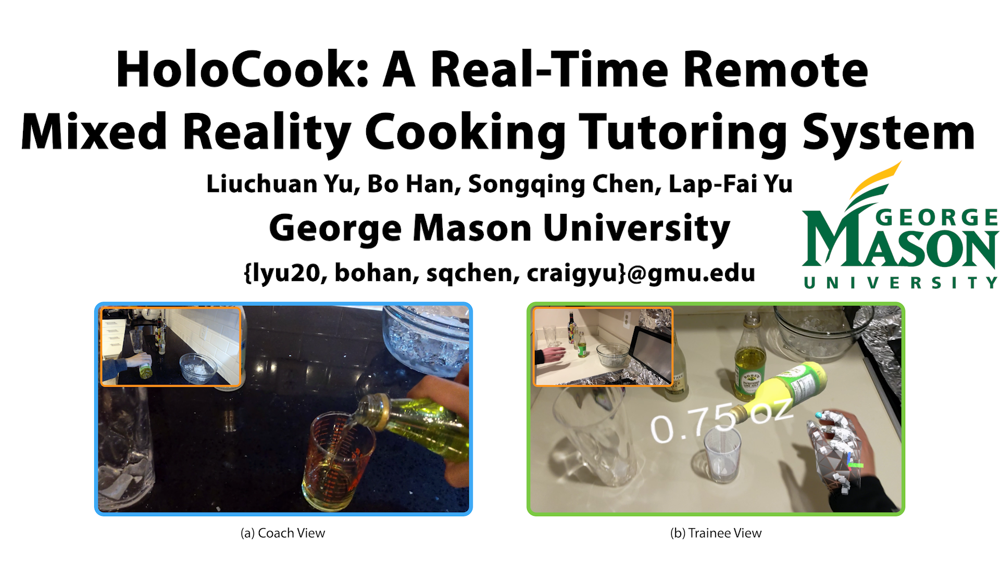
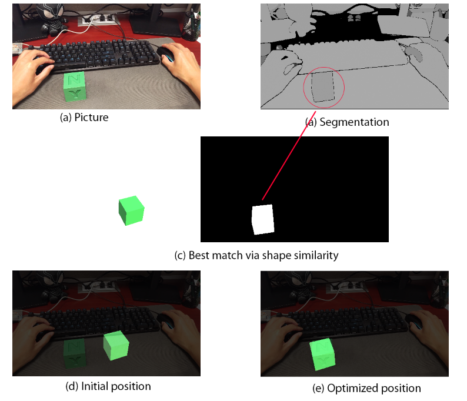

# HoloCook: A Real-Time Remote Mixed Reality Cooking Tutoring System

<div align="center">
<a href="https://www.chuange.org/papers/HoloCook.html"></a>&emsp;
<a href="https://youtu.be/VawN5NliBAk"></a>&emsp;
<a href="#"></a>&emsp;
<a href="https://www.chuange.org/files/HoloCook.pdf"></a>&emsp;
<a href="https://www.linkedin.com/in/liuchuan-yu-64a44621a"></a>&emsp;
<a href="mailto:lyu20@gmu.edu"></a>&emsp;

<a href="#"></a>&emsp;
</div>

## Environment Setup

### Clone Project

```
git clone https://github.com/luffy-yu/HoloAAC.git
cd HoloAAC
git submodule update --init --recursive
```

### Set Up

#### Development Environment
  1. Windows 11
  2. Unity 2020.3.20
  3. Microsoft Visual Studio Community 2019

#### Branches

There are three branches: master, pc, and hl2.

The source code is under **Unity/** folder in pc and hl2 branches. 

> **Unity** folder is empty in master branch.

- [pc](https://github.com/luffy-yu/HoloCook/tree/pc)

    Source code for the HoloCook PC client.

- [hl2](https://github.com/luffy-yu/HoloCook/tree/hl2)

    Source code for the HoloCook HoloLens 2 client.

PC client and HoloLens 2 client share the almost entire same code, 
but there are **four source files** that are different to resolve the compilation issues using comments, etc.

> <sub>1</sub>Photon Fusion only exists in pc branch under **Assets/Photon/**.

> <sub>2</sub>Photon Voice for HoloLens 2 plugin is not free, so it's not included in the source code.

<details>
  <summary>Four different files.</summary>

     .../CamStream/Scripts/CameraStreamHelper.cs        | 16 ++++++-------
     Assets/Scripts/HoloLens2/CoachMenuEvents.cs        | 16 ++++++-------
     Assets/Scripts/Sync/ImageFromVideoStream.cs        | 24 +++++++++----------
     Assets/Scripts/Sync/ImageSender.cs                 | 28 +++++++++++-----------

</details>


<details>
  <summary>Here is an example of the difference of `CoachMenuEvents.cs` file</summary>

    diff --git a/Assets/Scripts/HoloLens2/CoachMenuEvents.cs b/Assets/Scripts/HoloLens2/CoachMenuEvents.cs
    --- a/Assets/Scripts/HoloLens2/CoachMenuEvents.cs
    +++ b/Assets/Scripts/HoloLens2/CoachMenuEvents.cs
    @@ -3,13 +3,13 @@
     // Licensed under the MIT License. See LICENSE file in the project root for full license information.
     //

    -#if !UNITY_WSA // not windows uwp
    -using UnityEngine;
    -public class CoachMenuEvents : MonoBehaviour
    -{
    -
    -}
    -#else
    +// #if !UNITY_WSA // not windows uwp
    +// using UnityEngine;
    +// public class CoachMenuEvents : MonoBehaviour
    +// {
    +//
    +// }
    +// #else
     using System;
     using System.Collections.Concurrent;
     using System.Collections.Generic;
    @@ -544,4 +544,4 @@ namespace HoloCook.HoloLens2
             #endregion
         }
     }
    -#endif
    \ No newline at end of file
    +// #endif
    \ No newline at end of file

</details>

### Run

<details>
  <summary>PC</summary>

  #### How to run?
  1. Checkout pc branch via `git checkout pc`
  2. Open this project source under **Unity/** with Unity
  3. Open the PC scene
  4. Run in the editor
     - Change the HoloLens 2 ip in `Server -- Netly Target Host -- IP Address`
  5. Build and run
     - Create a `hololens2.ip` within the same folder as the built executable `HoloCook.exe`.
       - The content is like `192.168.0.163:8888`, where `192.168.0.163` is the ip of the HoloLens 2, and `8888` is the port of the **PC**.
       - If this file doesn't exist, it will use the default setting.
       - Sample file is [here](docs/hololens2.ip). 
  > Note that HoloLens 2 always uses the `8888` port for TCP communication.
  6. The built application can be deployed in another PC or the same PC as long as they are networked reachable.
     - If they are running in the same pc, make sure that they are in different folders (just make a copy of the build folder) and use different ports (e.g., 8888 and 9999).
  > Ensure Windows firewall is properly configured.
</details>

<details>
  <summary>HoloLens 2</summary>

  #### How to run?
  1. Checkout hl2 branch via `git checkout hl2`
  2. Open this project source under **Unity/** with Unity
  3. Open this HoloLens2 scene
  4. Build and run
     - It can be simply built without changing anything.
     - Open with VS 2019, and build it with `Release`, `ARM64`.
     - Deploy it.
     - Allow the permission request at the 1st running.
     - It will load the configuration file `host.ip` under `\User Folders\LocalAppData\HoloCook_1.0.0.0_arm64__xxxxxxxxxxxx\LocalState\`.
       - The content is like `192.168.0.221:8888`, where `192.168.0.221` is the ip of the PC, and `8888` is the port of the **PC**.
       - If this file doesn't exist, it will use the default setting.
       - Sample file is [here](docs/host.ip).
</details>

#### How to start tutoring?

1. Prepare two kitchens
   - Kitchen wares and tools
   - Ingredients
2. Refer to the [video](https://www.youtube.com/watch?v=VawN5NliBAk&t=41s)

### One More Thing

More than the HoloCook system itself that is mentioned in this paper, some functionalities that I have preliminarily explored are also open sourced in this repository,
such as:

1. Video Stream / Image Capture with Locatable Camera Parameters [CamStream/, ImageFromVideoStream.cs, ImageSender.cs]
   - Thanks to this [project](https://github.com/VulcanTechnologies/HoloLensCameraStream) [included].
2. Trajectory Mapping [TrajectoryFitting.cs] [video demostration](https://youtu.be/WcxH6e2aFVQ)
3. Action Recording and Replay [ActionRecordSyncer.cs] [video demostration](https://youtu.be/fqAhp-uc4a8)
4. Registration on a Known Plane [RegistrationNetwork.cs] [video demostration](https://youtu.be/Uem-LAxz9tY)
   - Pipeline: Picture --> Python (segmentation by (SAM)[https://segment-anything.com/], not included) --> Unity --> HoloLens 2

    <details>
      <summary>An example</summary>
    
     
    
    </details>

5. Opencv Module Adaptation from [OpenCvSharp](https://github.com/shimat/opencvsharp.git) [included, used in RegistrationNetwork.cs]

**If you are interested in these functionalities, feel free to reach out to me at lyu20@gmu.edu. I am glad to help or even collaborate.**


### Citation

**If you find this work useful, please cite it using the following format.**

```
@inproceedings{yu2024holocook,
  title={HoloCook: A Real-Time Remote Mixed Reality Cooking Tutoring System},
  author={Yu, Liuchuan and Han, Bo and Chen, Songqing and Yu, Lap-Fai},
  booktitle={International Conference on Human-Computer Interaction},
  year={2024},
  organization={Springer}
}
```